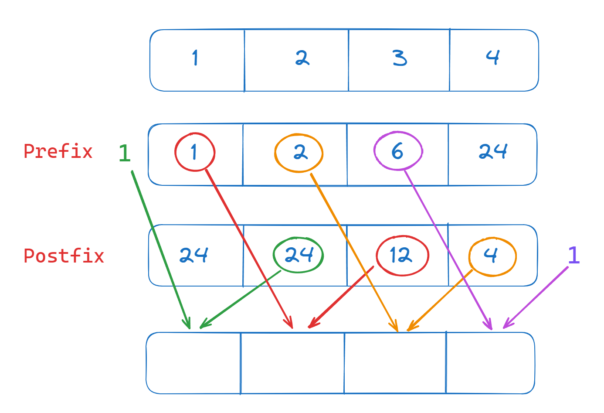

# Leetcode 238 - Product of Array Except Self 解題過程

最近碰到這題，覺得解題過程蠻有趣的就來分享一下。

```
Given an integer array nums, return an array answer such that answer[i] is equal to the product of all the elements of nums except nums[i].

The product of any prefix or suffix of nums is guaranteed to fit in a 32-bit integer.

You must write an algorithm that runs in O(n) time and without using the division operation.
```

題目的意思是給定一個整數數組 nums，返回一個數組 answer，其中 answer[i] 等於 nums 中除 nums[i] 之外所有元素的乘積。

<!-- more -->

---------

### **範例**

**Example 1:**

> Input: nums = [1,2,3,4]

> Output: [24,12,8,6]

**Example 2:**

> Input: nums = [-1,1,0,-3,3]

> Output: [0,0,9,0,0]


nums 最大長度為10^5次方，所以必須設計一個O(n)或是O(nlogn)的時間複雜度才不會TLE，就沒辦法使用雙層迴圈O(n ^ 2)，當 i = j 時就不做乘法的簡單作法。

### **解題**

那該如何解這題呢? 我們可以看到下面這張圖，利用 Prefix array 和 Postfix array 的方法

Prefix array 的公式為 (Prefix array 一開始都是1，第 i 項要乘上 nums 的前一項和自己的前一項，最後的值不需要，所以是[1,1,2,6])

$$
\text{prefix_sum}[i] = \text{prefix_sum}[i-1] * \text{nums}[i-1] \quad \text{for } i = 1, 2, \ldots, n - 1
$$

Postfix array 的公式為 (Postfix array 一開始都是1，第 i 項要乘上nums後一項和自己的後一項，最前的值不需要，所以是[24,12,4,1])

$$
\text{post_sum}[i] = \text{post_sum}[i+1] * \text{nums}[i+1] \quad \text{for } i = n-2, n-3, \ldots, 0
$$



對於當前值，我們都只要把它的 Prefix 乘上 Postfix 就搞定了

Prefix array 程式碼如下(照著上面公式寫就行了):
```C++
int n = nums.size();
vector<int> PrefixArray(n);

PrefixArray[0] = 1;
for(int i = 1;i<nums.size();i++) {
    PrefixArray[i] = PrefixArray[i - 1] * nums[i - 1];
}

# PrefixArray: [1,1,2,6]
```

Postfix array 程式碼如下(照著上面公式寫就行了):
```C++
vector<int> PostfixArray(n);

PostfixArray[n- 1] = 1;
for(int i = n - 2;i>=0;i--) {
    PostfixArray[i] = PostfixArray[i+1] * nums[i+1];
}

# PostfixArray: [24, 12, 4, 1]
```

最後再把兩邊的值乘起來就搞定了
```C++
vector<int> ans(n);

for(int i=0; i<n; i++){
    ans[i] = PrefixArray[i] * PostfixArray[i];
}

return ans;
```

完成程式碼如下:
```C++
class Solution {
public:
    vector<int> productExceptSelf(vector<int>& nums) {
        int n = nums.size();
        vector<int> PrefixArray(n);

        PrefixArray[0] = 1;
        for(int i = 1;i<nums.size();i++) {
            PrefixArray[i] = PrefixArray[i - 1] * nums[i-1];
        }

        vector<int> PostfixArray(n);

        PostfixArray[n- 1] = 1;
        for(int i = n - 2;i>=0;i--) {
            PostfixArray[i] = PostfixArray[i+1] * nums[i+1];
        }

        vector<int> ans(n);

        for(int i=0; i<n; i++){
            ans[i] = PrefixArray[i] * PostfixArray[i];
        }

        return ans;
    }
};
```

而實際程式碼我們其實不需要這兩個 array 就可以直接達到我們的目的，可以用同一個vector來節省空間，透過以下程式碼得到 Prefix array:

```C++
int p = 1;
for(int i = 1;i<nums.size();i++) {
    p = p * nums[i-1];
    answer[i] = p;
}

# answer: [1,1,2,6]
```

再透過以下程式碼乘上 Postfix
```C++
p = 1;

for(int i = nums.size() - 2;i>=0;i--) {
    p = p * nums[i+1];
    answer[i] *= p;
}
```

這題就結束摟~

完整程式碼如下:
```C++
class Solution {
public:
    vector<int> productExceptSelf(vector<int>& nums) {
        int n = nums.size();
        vector<int> answer(n, 1);

        int p = 1;
        for(int i = 1;i<nums.size();i++) {
            p = p * nums[i-1];
            answer[i] = p;
        }

        p = 1;

        for(int i = nums.size() - 2;i>=0;i--) {
            p = p * nums[i+1];
            answer[i] *= p;
        }

        return answer;
    }
};
```
 
